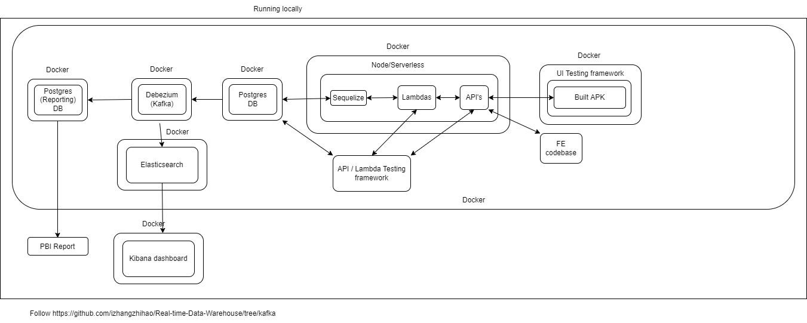

# Sample CF/ Serverless / Integration Testing project

## Tech stack

- NodeJS 14.x+
- Aurora Postgres (via a Postgres docker image if local)
- Redshift (via docker if local)
- Serverless & Serverless Offline CLI (if local)

## Overview diagram of project structure

The above diagram shows the basic architecture. 

The basic structure is an API Gateway pointing to a set of lambdas, which interact with a Postgres instance. The Postgres instance then feeds into a AWS Redshift data lake. A PBI report would then interact through the Redshift instance.

The basic data model would be visits to stores. 

Integration and UI test frameworks will also be included as part of this project. The integration test framework will follow that currently used in DFE.

The UI test framework will run in a separate container. It will check out the code, build the apk, install the apk on an emulator and run the UI tests against that emulator.

Progress:
30/08 Serverless project and Postgres containers set up and connected. Serverless uses the Sequelize library to communicate with the database.
